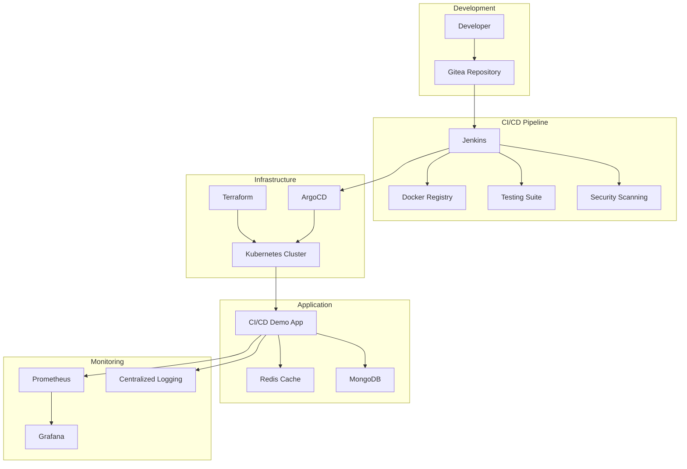

# 🚀 Modern DevOps Demo

> **An enterprise-grade demonstration of advanced DevOps practices, showcasing service mesh, distributed tracing, chaos engineering, cost optimization, and advanced security policies.**

[](https://github.com/amineatya/cicd-demo)
[](https://github.com/amineatya/cicd-demo)
[](https://github.com/amineatya/cicd-demo)
[](https://github.com/amineatya/cicd-demo)

## 🎯 Overview

This enterprise-level application demonstrates advanced DevOps practices including:

- **🔧 Advanced CI/CD Pipeline** - Multi-stage Jenkins pipeline with parallel execution
- **📊 Monitoring & Observability** - Prometheus metrics, structured logging, health checks
- **🔒 Security Best Practices** - Container security, network policies, secret management
- **☸️ Kubernetes Native** - Production-ready manifests with security contexts
- **🏗️ Infrastructure as Code** - Terraform for infrastructure provisioning
- **🔄 GitOps Workflow** - ArgoCD for continuous deployment
- **🧪 Comprehensive Testing** - Unit, integration, E2E, and load testing
- **📈 Performance Optimization** - Load testing, caching, rate limiting
- **🌐 Service Mesh Integration** - Istio for advanced traffic management
- **🔍 Distributed Tracing** - Jaeger for request tracing across services
- **🐒 Chaos Engineering** - Resilience testing and failure simulation
- **💰 Cost Optimization** - Resource utilization analysis and recommendations
- **🛡️ Advanced Security** - OPA policies for Kubernetes and application security
- **📊 Expert Monitoring** - Custom Grafana dashboards and advanced metrics

## 🏗️ Architecture



## 🚀 Key Features

### 🔧 Advanced CI/CD Pipeline
- **Multi-stage Pipeline**: Build, test, security scan, deploy
- **Parallel Execution**: Concurrent testing and linting
- **Artifact Management**: MinIO integration for build artifacts
- **Rolling Deployments**: Zero-downtime updates
- **Smoke Testing**: Automated health verification

### 📊 Monitoring & Observability
- **Prometheus Metrics**: Custom application metrics
- **Health Checks**: Comprehensive health endpoints
- **Structured Logging**: Winston with multiple transports
- **Performance Monitoring**: Request duration, error rates
- **Grafana Dashboards**: Visual monitoring and alerting

### 🔒 Security Best Practices
- **Container Security**: Non-root user, minimal base image
- **Network Policies**: Pod-to-pod communication control
- **Secret Management**: Kubernetes secrets with encryption
- **Security Scanning**: npm audit, Docker Scout, Snyk
- **Rate Limiting**: DDoS protection and abuse prevention

### ☸️ Kubernetes Native
- **Production Manifests**: Resource limits, health probes
- **Security Contexts**: Pod security standards
- **Service Accounts**: Least privilege access
- **ConfigMaps & Secrets**: Configuration management
- **Horizontal Scaling**: Auto-scaling capabilities

## 📋 Prerequisites

- **Node.js** 18+ with npm 8+
- **Docker** 20+ with BuildKit support
- **Kubernetes** 1.24+ with kubectl configured
- **Helm** 3.8+ for package management
- **Terraform** 1.0+ for infrastructure
- **Jenkins** 2.400+ with required plugins
- **ArgoCD** 2.5+ for GitOps (optional)

## 🚀 Quick Start

### 1. Local Development

```bash
# Clone repository
git clone https://github.com/amineatya/cicd-demo.git
cd cicd-demo

# Install dependencies
npm install

# Run tests
npm run test:ci

# Start development server
npm run dev

# Test endpoints
curl http://localhost:3000/healthz
curl http://localhost:3000/metrics
curl http://localhost:3000/api-docs
```

### 2. Docker Development

```bash
# Build image
docker build -t cicd-demo:latest .

# Run container
docker run -p 3000:3000 cicd-demo:latest

# Test health endpoint
curl http://localhost:3000/healthz
```

### 3. Kubernetes Deployment

```bash
# Create namespace
kubectl create namespace demo

# Apply manifests
kubectl apply -f k8s/

# Check deployment
kubectl get pods -n demo
kubectl get svc -n demo

# Port forward for testing
kubectl port-forward svc/cicd-demo 8080:80 -n demo
curl http://localhost:8080/healthz
```

### 4. Infrastructure Setup

```bash
# Initialize Terraform
cd terraform
terraform init

# Plan infrastructure
terraform plan

# Apply infrastructure
terraform apply

# Get outputs
terraform output
```

## 🔧 Configuration

### Environment Variables

| Variable | Default | Description |
|----------|---------|-------------|
| `PORT` | `3000` | Application port |
| `NODE_ENV` | `development` | Environment mode |
| `LOG_LEVEL` | `info` | Logging level |
| `REDIS_URL` | - | Redis connection URL |
| `MONGODB_URI` | - | MongoDB connection string |
| `JWT_SECRET` | - | JWT signing secret |

### Kubernetes Configuration

The application is deployed with:

- **Namespace**: `demo`
- **Replicas**: 3 (with rolling updates)
- **Resources**: 256Mi-1Gi memory, 200m-1000m CPU
- **Health Checks**: Liveness, readiness, and startup probes
- **Security**: Non-root user, read-only filesystem

## 🧪 Testing Strategy

### Test Types

1. **Unit Tests** - Jest with 80%+ coverage threshold
2. **Integration Tests** - API endpoint testing
3. **End-to-End Tests** - Complete user flows
4. **Load Tests** - Artillery performance testing
5. **Security Tests** - Vulnerability scanning

### Running Tests

```bash
# Unit tests
npm test

# Integration tests
npm run test:integration

# E2E tests
npm run test:e2e

# Load testing
npm run load-test

# Security audit
npm run security:audit
```

## 📊 Monitoring & Metrics

### Prometheus Metrics

- `http_request_duration_seconds` - Request latency
- `http_requests_total` - Request count
- `active_connections` - Active connections
- `nodejs_memory_usage` - Memory utilization
- `nodejs_cpu_usage` - CPU utilization

### Health Endpoints

- **Health Check**: `GET /healthz`
- **Metrics**: `GET /metrics`
- **API Docs**: `GET /api-docs`
- **Status**: `GET /api/v1/status`

### Grafana Dashboards

Access Grafana at `http://localhost:30000` (admin/admin123) for:
- Application performance metrics
- Infrastructure monitoring
- Error rate tracking
- Resource utilization

## 🔄 CI/CD Pipeline

### Pipeline Stages

1. **Checkout** - Git repository checkout
2. **Build** - Docker image with multiple tags
3. **Test** - Parallel unit, integration, and security tests
4. **Security** - npm audit and vulnerability scanning
5. **Push** - Container registry upload
6. **Deploy** - Kubernetes deployment
7. **Smoke Test** - Health check verification

### Pipeline Features

- **Parallel Execution** - Concurrent testing stages
- **Artifact Storage** - MinIO integration
- **Rolling Deployments** - Zero-downtime updates
- **Health Verification** - Automated smoke tests
- **Status Reporting** - Gitea integration

## 🛠️ Development

### Project Structure

```
cicd-demo/
├── src/                    # Application source code
│   ├── app.js             # Main application
│   ├── app.test.js        # Unit tests
│   ├── integration.test.js # Integration tests
│   └── e2e.test.js        # End-to-end tests
├── k8s/                   # Kubernetes manifests
│   ├── deployment.yaml    # Application deployment
│   ├── service.yaml       # Service definition
│   ├── serviceaccount.yaml # Service account
│   ├── secrets.yaml       # Secret management
│   └── networkpolicy.yaml # Network policies
├── terraform/             # Infrastructure as Code
│   └── main.tf           # Terraform configuration
├── gitops/               # GitOps configuration
│   ├── application.yaml  # ArgoCD application
│   └── project.yaml     # ArgoCD project
├── tests/                # Test configurations
│   └── load-test.yml    # Artillery load test
├── Dockerfile           # Multi-stage container build
├── Jenkinsfile          # CI/CD pipeline
├── package.json         # Dependencies and scripts
└── README.md           # This file
```

### Adding Features

1. **API Endpoints** - Add routes in `src/app.js`
2. **Tests** - Create corresponding test files
3. **Documentation** - Update Swagger annotations
4. **Monitoring** - Add Prometheus metrics
5. **Security** - Implement validation and sanitization

## 🔒 Security

### Security Features

- **Container Security** - Non-root user, minimal image
- **Network Policies** - Pod communication control
- **Secret Management** - Kubernetes secrets
- **Input Validation** - express-validator integration
- **Rate Limiting** - DDoS protection
- **Security Headers** - Helmet.js middleware
- **Dependency Scanning** - npm audit integration

### Security Checklist

- [ ] Container runs as non-root user
- [ ] Read-only root filesystem
- [ ] Security headers configured
- [ ] Input validation implemented
- [ ] Rate limiting enabled
- [ ] Secrets properly managed
- [ ] Network policies applied
- [ ] Dependencies scanned

## 📈 Performance

### Optimization Features

- **Compression** - gzip response compression
- **Caching** - Redis integration
- **Connection Pooling** - Database optimization
- **Load Balancing** - Kubernetes service
- **Resource Limits** - CPU and memory constraints
- **Horizontal Scaling** - Auto-scaling support

### Load Testing

```bash
# Run load test
npm run load-test

# Performance metrics
npm run performance
```

## 🤝 Contributing

1. Fork the repository
2. Create a feature branch (`git checkout -b feature/amazing-feature`)
3. Commit your changes (`git commit -m 'Add amazing feature'`)
4. Push to the branch (`git push origin feature/amazing-feature`)
5. Open a Pull Request

### Development Guidelines

- Follow ESLint configuration
- Maintain 80%+ test coverage
- Update documentation
- Add appropriate tests
- Follow security best practices

## 📄 License

This project is licensed under the MIT License - see the [LICENSE](LICENSE) file for details.

## 🙏 Acknowledgments

- **DevOps Community** - For best practices and patterns
- **Kubernetes Community** - For excellent documentation
- **Node.js Community** - For robust ecosystem
- **Open Source Contributors** - For amazing tools and libraries

---

**Built with ❤️ by [Amine Atya](https://github.com/amineatya)**

> This project demonstrates enterprise-grade DevOps practices and is designed to showcase advanced skills in CI/CD, Kubernetes, monitoring, and infrastructure automation.
